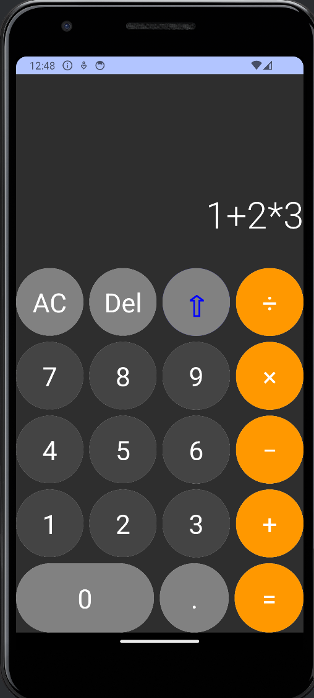
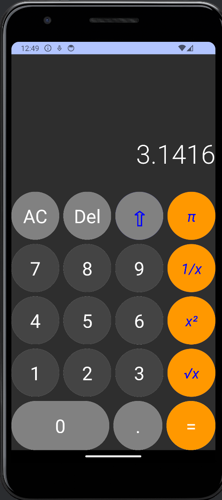

# Android Calculator App
> Written in Kotlin using the Jetpack Compose

As picked up from the great YT tutorial: [How to Build a Calculator with Jetpack Compose](https://youtu.be/-aTcFJWxEQA?si=lAG7yqoqULSga9c5)

I followed the tutorial which created the basic layout of the calculator;
then I replaced the logic with my own that I created in collaboration
with the Github Co-Pilot (a fantastic addition to the Software writing toolbox!). 

Basically what I did:

* proper handling of the arithmetic expressions honoring operator precedence
* added a Shift mechanism to provide extended functionality (e.g square-root)

## Screen shots

